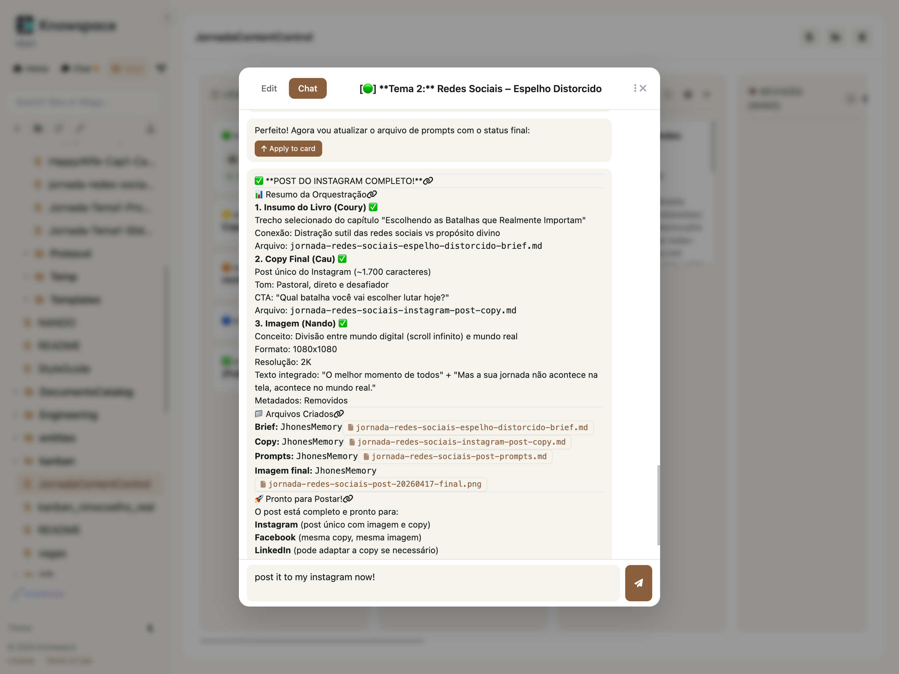
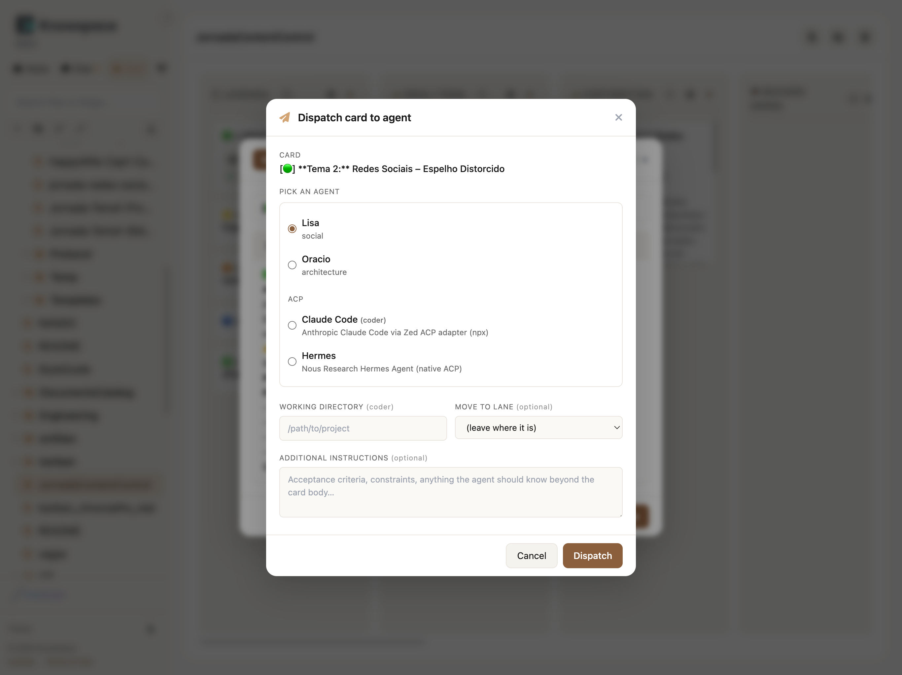
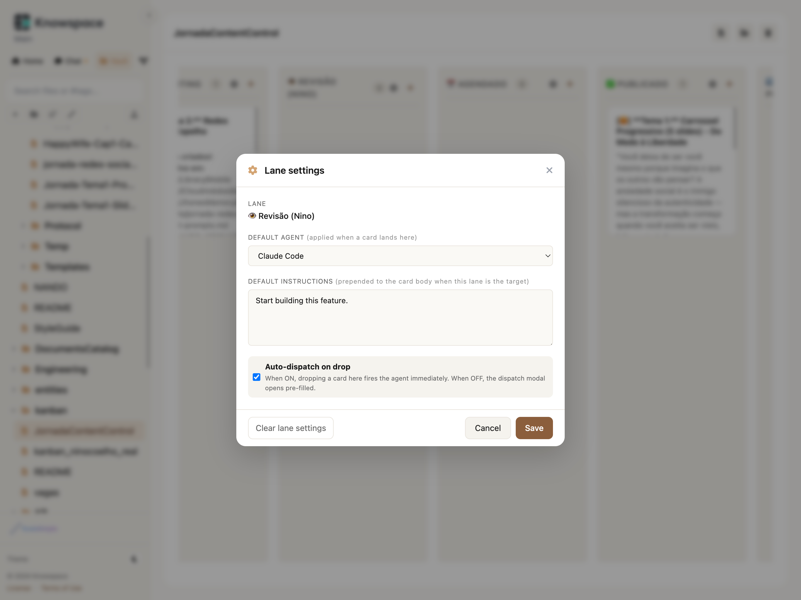

<p align="center">
  
</p>

<h1 align="center">Knowspace</h1>

<p align="center">
  <strong>The web portal for your AI agents — any agent, in one tab.</strong>
</p>

<p align="center">
  Chat, files, kanban, and a dispatch flow that turns cards into agent
  sessions. Talks to <a href="https://github.com/openclaw/openclaw">OpenClaw</a>,
  <a href="https://www.anthropic.com/claude-code">Claude Code</a>,
  <a href="https://github.com/nousresearch/hermes-agent">Hermes</a>, and
  <a href="https://github.com/openai/codex">Codex</a> via the
  <a href="https://agentclientprotocol.com/">Agent Client Protocol</a>.
</p>

<p align="center">
  <a href="#why-knowspace">Why</a> &middot;
  <a href="#screenshots">Screenshots</a> &middot;
  <a href="#features">Features</a> &middot;
  <a href="#quick-start">Quick Start</a> &middot;
  <a href="#architecture">Architecture</a> &middot;
  <a href="#contributing">Contributing</a>
</p>

---

## Why Knowspace?

You already drive coding agents from a terminal. Your work — briefs, drafts, designs, releases — happens on a kanban. Knowspace closes the gap: drop a card into a lane, the right agent picks it up, and replies stream back inside the card. No tab switching, no copy-pasting context.

- **Multi-provider, single tab.** Chat with OpenClaw agents (Jhones, Nando, …) and ACP agents (Claude Code, Hermes, Codex) from the same sidebar.
- **Kanban that ships work.** Cards live as plain markdown (Obsidian-compatible). A lane can have a default agent + instructions; drop a card and it dispatches.
- **Handoff that keeps context.** Each session is recorded on the card. Re-dispatching includes an excerpt of the previous agent's turn so the next one picks up where it left off.
- **Vault-aware previews.** File paths in agent replies become clickable pills with inline preview, image rendering, and one-click download.
- **Single user, real auth.** Token via login form (no secrets in URLs after the first onboarding link). One vault, no multi-tenant ceremony.

One Node process. One port. Zero database.

---

## Screenshots

<table>
  <tr>
    <td align="center"><b>Kanban with linked agent sessions</b></td>
    <td align="center"><b>Dispatch a card to an agent</b></td>
  </tr>
  <tr>
    <td></td>
    <td></td>
  </tr>
  <tr>
    <td align="center"><b>Lane settings (agent + auto-dispatch)</b></td>
    <td align="center"><b>Vault</b></td>
  </tr>
  <tr>
    <td></td>
    <td></td>
  </tr>
  <tr>
    <td align="center"><b>Chat sidebar</b></td>
    <td align="center"><b>Mermaid in vault</b></td>
  </tr>
  <tr>
    <td></td>
    <td></td>
  </tr>
</table>

---

## Features

### Multi-provider chat

- **Two backends, one UX.** OpenClaw via WebSocket gateway; Claude Code, Hermes, Codex (and any future ACP agent) via [Agent Client Protocol](https://agentclientprotocol.com/) over stdio.
- **Auto-detect on install.** The portal probes `which hermes` / `which codex` / `npx claude-agent-acp` and only lists agents you actually have.
- **Sidebar agent picker.** "+ ▾" next to "New chat" opens a dropdown grouped by provider. Coder agents prompt for a working directory.
- **Persistent ACP sessions.** Sessions survive a server restart; on the next message we silently `loadSession` (or fall back to a fresh one) so the user keeps their history.
- **Permission requests bubble to the UI.** When an ACP agent calls `requestPermission`, a themed modal lets you allow / reject. No UI connected → falls back to the YOLO default so unattended runs don't deadlock.
- **Terminal ops for coder agents.** Claude Code can actually run shell commands; output is buffered with a 1 MB cap.

### Kanban as a dispatch surface

- **Cards are markdown.** Edit them in Knowspace or directly in Obsidian. v2 adds invisible `<!-- ks:* -->` HTML comments for stable IDs and metadata.
- **Click a card → modal.** Edit / Chat tabs. The Chat tab follows the dispatched session — agent replies stream in live.
- **Dispatch a card.** Right-click → "Dispatch to agent…" → pick an agent, pick a target lane (optional), add free-form instructions, fire. The card moves, an envelope is sent, the chat tab opens to the new session.
- **Lane-level automation.** ⚙ on a lane: set a default agent + default instructions + an auto-dispatch toggle. Drop a card into the lane → either it dispatches immediately (if armed) or pre-fills the dispatch modal.
- **Handoff carries context.** Re-dispatching a card includes the last 8 turns from the previous session as `## Previous conversation (excerpt)` in the envelope, plus a `from=<sessionKey>` provenance comment.
- **Card meta on the board.** Pills under each card show `acp:claude-code` (assignee) + `running · 2 sessions` (latest dispatch state).
- **Cards have a max height.** Long bodies scroll inside the card so lanes stay scannable.

### Vault + file previews

- **Browse the agent workspace.** File tree, fuzzy search, markdown rendering with Mermaid + KaTeX + syntax highlighting.
- **File-path linkifier.** Any absolute or `~/` path in agent replies (chat sidebar, card chat, vault preview) becomes a `📄 basename` pill.
- **Click a pill → preview modal.** Markdown renders rich, text-y formats render `<pre>`, images render inline, binaries get a "open it locally" hint.
- **Smart resolver.** Five strategies in order: absolute → tilde → vault-rooted (`/Briefs/foo.md` interpreted as `<vault>/Briefs/foo.md`) → vault-relative → unique-basename fuzzy match. The modal tooltip shows which one resolved.
- **Download button.** Modal footer has copy-path + download buttons. Backend serves with proper Content-Type + `Content-Disposition`.

### Auth + portal

- **Login form, not URLs.** Token in a password input, POSTed to `/auth`. The legacy `/auth?token=…` link still works for first-boot onboarding, with `Cache-Control: no-store`.
- **Cookie-based session.** SameSite=Lax, 1-year max age, hashed token storage (SHA-256).
- **Command palette (Cmd/Ctrl+K), dark mode, keyboard shortcuts, daemon mode** with auto-start on login (launchd / systemd --user).

---

## Quick Start

### Requirements

- **Node.js 22+**
- **At least one agent backend.** Pick any combination:
  - [OpenClaw](https://github.com/openclaw/openclaw) running locally (gateway at `ws://127.0.0.1:18789`)
  - [Claude Code](https://www.anthropic.com/claude-code) (`npx @agentclientprotocol/claude-agent-acp` is bundled by Knowspace; just have `claude` authenticated)
  - [Hermes](https://github.com/nousresearch/hermes-agent) (`hermes acp` in PATH)
  - [Codex CLI](https://github.com/openai/codex) (`codex acp` in PATH; `codex login` first)

### Install

```bash
git clone https://github.com/NinoCoelho/knowspace.git
cd knowspace
npm install
npm link          # makes 'knowspace' available globally
```

### Configure (interactive)

```bash
knowspace configure
```

First run: 3-step wizard — OpenClaw gateway (optional), vault path (defaults to `~/.knowspace/vault`), public URL + first access token.

### Start

```bash
knowspace serve              # default port 3445
knowspace daemon install     # auto-start on login (macOS launchd / Linux systemd --user)
```

Open the printed URL. Sign in with your token.

---

## CLI Reference

```bash
knowspace serve [--port N]            Start the portal
knowspace connect                     Configure the OpenClaw gateway (optional)
knowspace configure [--reset]         Interactive setup wizard / menu

knowspace daemon install              Install + start as background service
knowspace daemon uninstall            Stop and remove
knowspace daemon start|stop|restart   Control
knowspace daemon status               Print status + PID
knowspace daemon logs [--error]       Tail logs

knowspace tokens info                 Show the current token's status
knowspace tokens generate             Generate a new access token
knowspace tokens rotate               Rotate the existing token

knowspace providers list              Show registered providers + status
knowspace providers enable|disable    Toggle a provider in providers.json
knowspace providers path              Print providers.json location

knowspace agents list [--provider id] List agents (auto-detected, hides missing binaries)
knowspace agents add <id> --cmd <bin> Register a new ACP agent
   [--name --kind --args --cwd --description]
knowspace agents remove <id>          Remove an ACP agent override
knowspace agents show <id>            Print resolved recipe (overrides + builtin)
```

---

## Architecture

```
Browser → Knowspace Portal → Provider Registry ┬─ openclaw  → WebSocket gateway → OpenClaw
                                                └─ acp       → JSON-RPC stdio   → Claude Code / Hermes / Codex
```

Two providers, one chat loop. The `lib/session-router` maps a session key prefix (`agent:` → openclaw, `acp:` → acp) to its owning provider, so every chat operation, dispatch, and history fetch routes transparently.

```
server.js                       Express + Socket.IO server
adapters/providers/             Provider abstraction (multi-backend)
  types.js                        Provider interface (JSDoc contract)
  index.js                        Registry: getProvider / listProviders
  config.js                       Loads ~/.knowspace/providers.json
  openclaw/                       OpenClaw provider (WebSocket gateway)
    paths.js, messages.js, sessions.js, chat.js, index.js
  acp/                            ACP provider (Claude Code, Hermes, Codex, …)
    agents.js                     Built-in recipes
    connection.js                 Spawned subprocess + ACP connection lifecycle
    session-store.js              In-memory buffer (push → poll bridge) + reverse index
    persistence.js                Per-session JSON files under ~/.knowspace/sessions/acp/
    terminals.js                  ACP terminal ops (createTerminal/output/wait/kill)
    probe.js                      Availability check + 5-min cache
    index.js                      Provider implementation
lib/
  gateway.js                      Low-level WebSocket RPC (Ed25519 device auth, OpenClaw only)
  kanban.js                       Markdown parser/serializer with ks:* metadata
  envelope.js                     Renders the dispatch context envelope as markdown
  session-router.js               Session-key prefix → owning provider
  permission-broker.js            ACP requestPermission → WebSocket → modal
  file-resolver.js                Multi-strategy path resolution (vault-rooted, fuzzy, …)
middleware/auth.js                Token auth (SHA-256 hashed)
routes/api.js                     REST: vault, kanban, dispatch, providers, agents, file preview/raw
public/
  index.html                      SPA entry + all CSS
  js/app.js                       Frontend (vanilla JS, no framework)
bin/knowspace.js                  CLI entry
cli/                              CLI commands (serve, connect, configure, daemon, tokens, providers, agents)
tests/                            ~180 unit + contract tests (node:test, no live agents needed)
```

**Key invariants:**
- `server.js` never imports `lib/gateway.js` directly — all OpenClaw interaction goes through `adapters/providers/openclaw/`.
- `server.js` and `routes/api.js` route session operations through `lib/session-router` or the provider registry — never hardcode a provider for new code paths.
- Single user. Token still flows through `req.clientSlug` internally for compatibility, but the CLI and UX never expose it.

**Stack:** Node.js + Express + Socket.IO + vanilla JS + filesystem. No database. No build step.

---

## Configuration files

| File | Purpose |
|------|---------|
| `~/.knowspace/config.json` | Vault path, public base URL, OpenClaw gateway pointer |
| `~/.knowspace/providers.json` | Provider on/off + ACP agent overrides |
| `~/.knowspace/sessions/acp/*.json` | Persisted ACP session state |
| `~/.knowspace/.env` | Environment variables loaded at start |
| `.tokens.json` (repo dir) | SHA-256 hashed access token |
| `.device-keys.json` (repo dir) | Ed25519 keypair for OpenClaw gateway auth |

## Environment variables

| Variable | Description | Default |
|----------|-------------|---------|
| `KNOWSPACE_PORT` | Portal port | `3445` |
| `KNOWSPACE_BASE_URL` | Public URL (used in token links) | `http://localhost:<port>` |
| `KNOWSPACE_GATEWAY_URL` | OpenClaw gateway WebSocket URL | `ws://127.0.0.1:18789` |
| `KNOWSPACE_GATEWAY_TOKEN` | OpenClaw gateway auth token | read from `~/.openclaw/openclaw.json` |
| `KNOWSPACE_TOKENS_FILE` | Tokens file path | `.tokens.json` |
| `KNOWSPACE_PROVIDERS_FILE` | Provider config file | `~/.knowspace/providers.json` |
| `KNOWSPACE_ACP_SESSIONS_DIR` | ACP session persistence dir | `~/.knowspace/sessions/acp` |
| `KNOWSPACE_ACP_DEBUG` | When truthy, log every ACP `sessionUpdate` to stderr | unset |
| `KNOWSPACE_ADMIN_SLUG` | Internal slug used by the auth layer (single-user default) | `main` |

---

## Roadmap

**Soon**
- Mobile-responsive layout
- PDF / CSV renderers in the vault preview modal
- Notification when an agent finishes a long-running dispatched task
- Provider health view in the UI (probe results, last-error per agent)

**Later**
- More ACP-compatible agents as they ship (Gemini CLI is wired, just not auto-listed)
- Plugin system for custom vault renderers and provider implementations
- Windows daemon (Windows Service)
- Real auth (OAuth, magic-link) for shared deployments

Have an idea? Open an issue with `enhancement`.

---

## Contributing

Knowspace is open source and contributions are welcome. See [CONTRIBUTING.md](CONTRIBUTING.md).

**Good first contributions:**
- Add a probe heuristic for a new ACP agent
- Vault renderers (PDF, CSV)
- Mobile layout pass on the kanban
- More tests on the dispatch / handoff flow

Quick start: fork → branch → `npm test` → PR.

---

## License

[MIT](LICENSE) &middot; Copyright &copy; 2026 Idemir Dias Coelho

This project follows the [Contributor Covenant](CODE_OF_CONDUCT.md) code of conduct.
