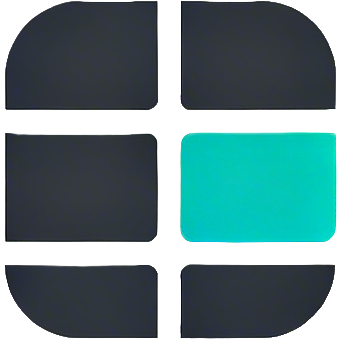
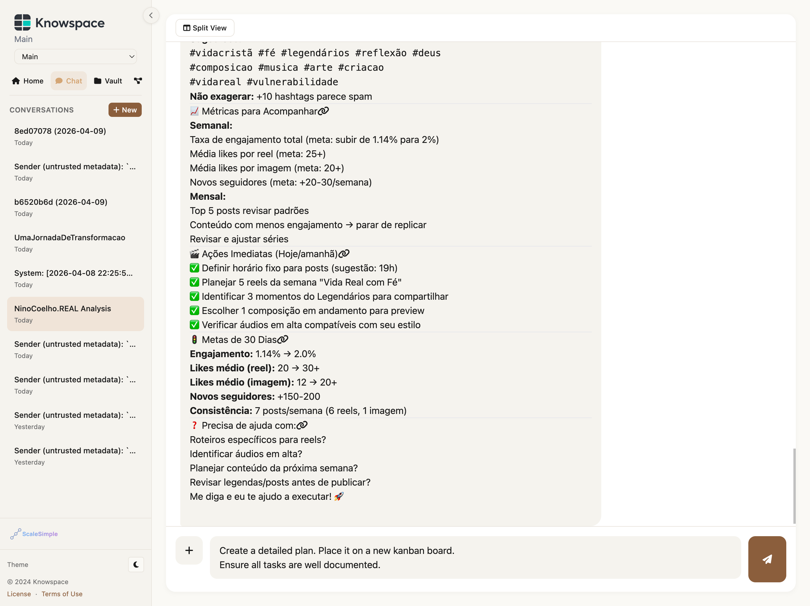
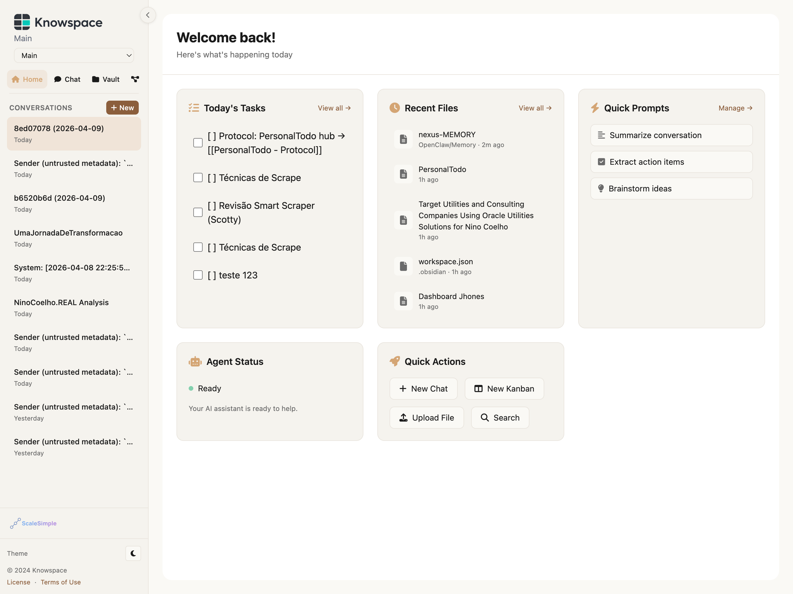
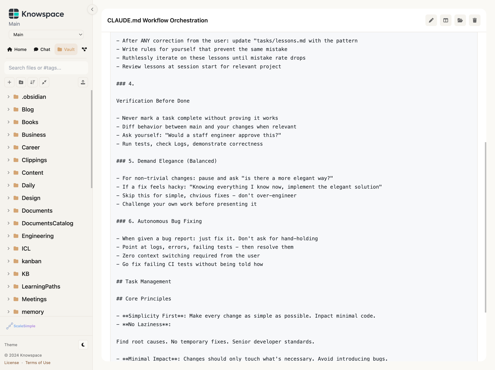
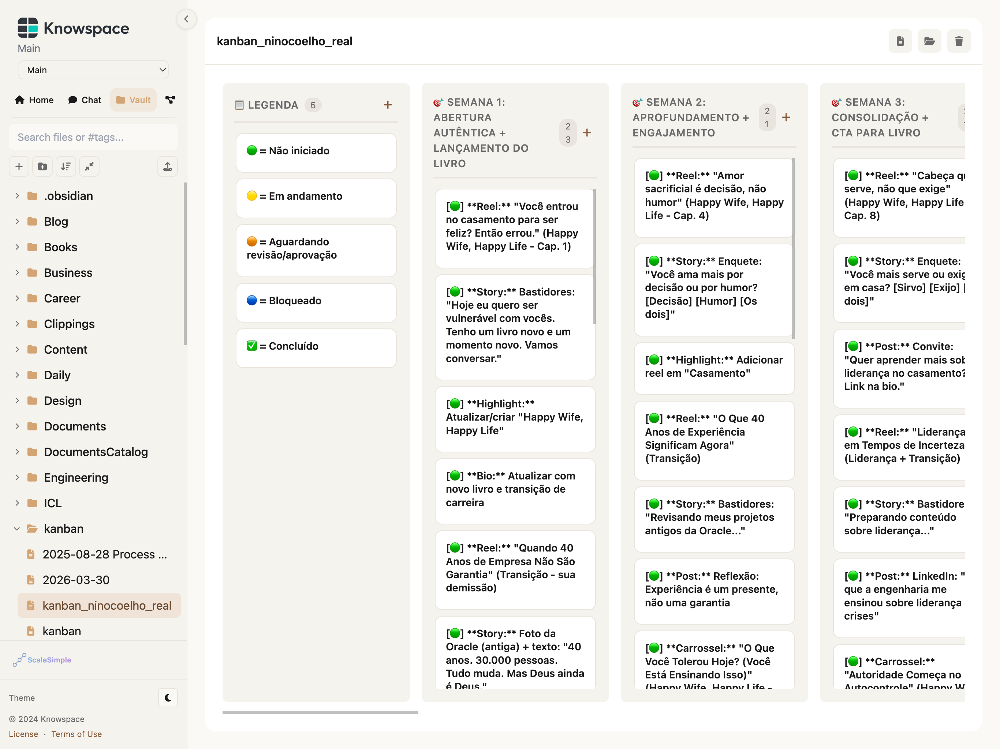
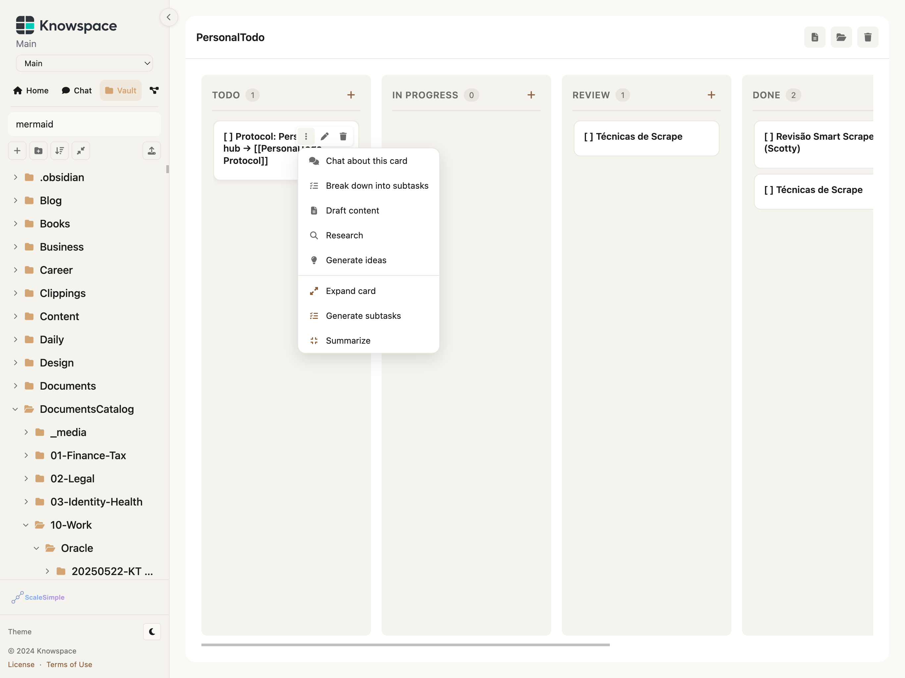
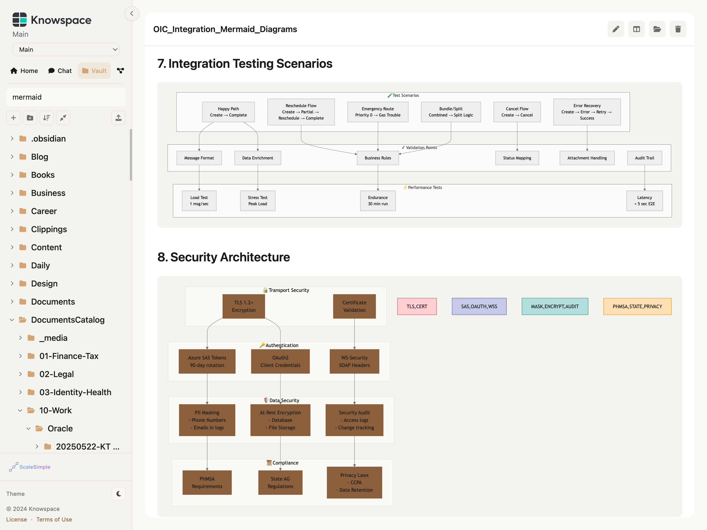

<p align="center">
  
</p>

<h1 align="center">Knowspace</h1>

<p align="center">
  <strong>The web portal for your AI agents.</strong>
</p>

<p align="center">
  Chat, files, and tasks — all in one browser tab. Built as a sidecar for
  <a href="https://github.com/openclaw/openclaw">OpenClaw</a>.
</p>

<p align="center">
  <a href="#features">Features</a> &middot;
  <a href="#screenshots">Screenshots</a> &middot;
  <a href="#quick-start">Quick Start</a> &middot;
  <a href="#contributing">Contributing</a> &middot;
  <a href="#license">License</a>
</p>

---

## Why Knowspace?

You already talk to your AI agent in a terminal. Your clients shouldn't have to.

Knowspace gives every OpenClaw agent a clean, professional web interface — no Docker, no database, no infrastructure to manage. Spin it up next to your existing OpenClaw installation and your clients get:

- **Real-time chat** with the agent, with full history and file attachments
- **A file vault** to browse, read, and search agent workspace files
- **A Kanban board** to track tasks — stored as plain markdown, compatible with Obsidian
- **A knowledge graph** that visualizes how vault files connect
- **Multi-client support** — onboard new clients with a single command, each with their own workspace and access token

One process. One port. Zero dependencies beyond Node.js and OpenClaw.

---

## Screenshots

<table>
  <tr>
    <td align="center"><b>Chat</b></td>
    <td align="center"><b>Home</b></td>
  </tr>
  <tr>
    <td></td>
    <td></td>
  </tr>
  <tr>
    <td align="center"><b>Vault</b></td>
    <td align="center"><b>Kanban Board</b></td>
  </tr>
  <tr>
    <td></td>
    <td></td>
  </tr>
  <tr>
    <td align="center"><b>Kanban Quick Actions</b></td>
    <td align="center"><b>Mermaid Diagrams</b></td>
  </tr>
  <tr>
    <td></td>
    <td></td>
  </tr>
</table>

---

## Features

### Chat

- Real-time conversation with your OpenClaw agent via WebSocket
- Full message history, preserved across sessions
- File attachments — send documents and images to the agent
- Streaming replies with live tool activity display
- Actionable message buttons (retry, branch, edit)
- Split view — chat alongside vault or kanban
- Multiline input with Shift+Enter

### Vault

- Browse the agent workspace as a file tree
- Render markdown with syntax highlighting and Mermaid diagrams
- Fuzzy search across all vault files
- Smart inline previews for vault links in chat
- Upload, create, edit, and delete files
- Auto-refresh after agent creates new files

### Kanban

- Drag-and-drop task board
- Cards stored as Obsidian-compatible markdown files
- AI quick actions on cards — summarize, break down, generate subtasks
- Per-card chat tab for contextual AI conversations
- Multiple boards per client

### Knowledge Graph

- Force-directed graph of vault file connections
- Folder color coding and folder filter
- Zoom, pan, and hover details
- Orphan node toggle and text filter

### Portal

- Command palette (Ctrl+K) for quick navigation
- Dark and light themes
- Keyboard shortcuts for all major actions
- Token-based authentication with per-client access
- Session management — create, rename, and delete conversations
- Background daemon mode with auto-start on login

---

## Quick Start

### Requirements

- Node.js 22+
- [OpenClaw](https://github.com/openclaw/openclaw) installed and running

### Install

```bash
git clone https://github.com/NinoCoelho/knowspace.git
cd knowspace
npm install
npm link          # makes 'knowspace' available globally
```

### Connect to OpenClaw

```bash
knowspace connect
```

Detects your OpenClaw gateway, saves the connection, and installs the onboard skill.

### Configure

```bash
knowspace configure
```

Interactive wizard on first run — sets the gateway URL, configures your vault path, and generates the first access token.

### Start

```bash
knowspace serve              # default port 3445
knowspace serve --port 4000
```

Or install as a background daemon (auto-starts on login):

```bash
knowspace daemon install
```

Open the printed URL in your browser. Done.

---

## CLI Reference

```bash
knowspace connect              # configure gateway + install onboard skill
knowspace configure            # interactive setup wizard / menu
knowspace configure --reset    # force wizard again
knowspace serve                # start the portal (default port 3445)
knowspace serve --port 4000
knowspace daemon install       # write service file, enable auto-start, start now
knowspace daemon uninstall     # stop and remove service file
knowspace daemon start
knowspace daemon stop
knowspace daemon restart
knowspace daemon status
knowspace daemon logs          # tail -f ~/.knowspace/knowspace.log
knowspace daemon logs --error  # tail -f ~/.knowspace/knowspace.error.log
knowspace tokens list
knowspace tokens generate <slug>
knowspace tokens rotate <slug>
```

Daemon backend: `launchd` on macOS, `systemd --user` on Linux.

---

## Multi-Client & Onboarding

Knowspace supports multiple clients, each with their own workspace and access token.

**Main client** — configured manually via `knowspace configure`. The vault can point to any directory (iCloud, Obsidian vault, etc.).

**Onboarded clients** — created by the agent via the `knowspace-onboard` skill. To add a new client, just ask your agent:

> "Onboard a new client, slug: acme-corp"

The agent creates the workspace, registers with OpenClaw, generates an access token, and returns the login link.

---

## Architecture

```
Browser → Knowspace Portal → Adapter Layer → OpenClaw Gateway
```

Knowspace is a sidecar. It adds a product layer (web UI, CLI, auth, vault, kanban) without modifying OpenClaw. All engine interaction is isolated to the adapter layer (`adapters/engine/`).

**Stack:** Node.js, Express, Socket.IO, vanilla JS, filesystem. No database.

```
server.js                    Express + Socket.IO server
adapters/engine/             Engine adapter layer (barrier between Knowspace and OpenClaw)
  index.js                     Barrel export
  paths.js                     Engine path conventions, session key formats
  messages.js                  Message normalization, filtering, status detection
  sessions.js                  Session CRUD via gateway RPC
  chat.js                      Chat: history, send, streaming poll
lib/gateway.js               Low-level WebSocket RPC client (Ed25519 device auth)
middleware/auth.js            Token authentication (SHA-256 hashed)
routes/api.js                 REST API: vault, kanban, graph
public/
  index.html                   SPA entry point + all CSS
  js/app.js                    Frontend (vanilla JS, no framework)
bin/knowspace.js             CLI entry point
cli/                         CLI commands (connect, configure, daemon, serve, tokens)
skills/
  knowspace-onboard/           Agent skill: onboards portal clients
templates/                   Workspace markdown templates
tests/adapters/              49 contract tests (node:test, no gateway needed)
```

**Rule:** `server.js` never imports `lib/gateway.js` directly. All engine calls go through `adapters/engine/`.

---

## Environment Variables

Set in shell or `~/.knowspace/.env`:

| Variable | Description | Default |
|----------|-------------|---------|
| `KNOWSPACE_GATEWAY_URL` | WebSocket URL of the OpenClaw gateway | `ws://127.0.0.1:18789` |
| `KNOWSPACE_GATEWAY_TOKEN` | Gateway auth token | read from `openclaw.json` |
| `KNOWSPACE_PORT` | Portal port | `3445` |
| `KNOWSPACE_BASE_URL` | Public URL (used in token links) | `http://localhost:<port>` |
| `KNOWSPACE_ADMIN_SLUG` | Slug for the first-boot auto-generated token | `main` |
| `KNOWSPACE_TOKENS_FILE` | Path to the tokens file | `.tokens.json` |

---

## Contributing

Knowspace is open source and we welcome contributions from the OpenClaw community.

**We're actively looking for:**

- Frontend improvements (accessibility, responsive design, i18n)
- New vault renderers (PDF, CSV/TSV tables, code notebooks)
- Integrations (calendar, email, project management tools)
- Testing and CI/CD
- Documentation and examples

**How to contribute:**

1. Fork the repository
2. Create a feature branch (`git checkout -b feature/my-feature`)
3. Make your changes — keep the adapter boundary clean (`server.js` never imports `lib/gateway.js`)
4. Run `npm test` to verify the adapter contract tests pass
5. Open a pull request

If you're building something with OpenClaw and want a web interface, this is the project for you. Open an issue to discuss ideas, or jump straight in with a PR.

---

## License

MIT License

Copyright (c) 2026 Idemir Dias Coelho

Permission is hereby granted, free of charge, to any person obtaining a copy
of this software and associated documentation files (the "Software"), to deal
in the Software without restriction, including without limitation the rights
to use, copy, modify, merge, publish, distribute, sublicense, and/or sell
copies of the Software, and to permit persons to whom the Software is
furnished to do so, subject to the following conditions:

The above copyright notice and this permission notice shall be included in all
copies or substantial portions of the Software.

THE SOFTWARE IS PROVIDED "AS IS", WITHOUT WARRANTY OF ANY KIND, EXPRESS OR
IMPLIED, INCLUDING BUT NOT LIMITED TO THE WARRANTIES OF MERCHANTABILITY,
FITNESS FOR A PARTICULAR PURPOSE AND NONINFRINGEMENT. IN NO EVENT SHALL THE
AUTHORS OR COPYRIGHT HOLDERS BE LIABLE FOR ANY CLAIM, DAMAGES OR OTHER
LIABILITY, WHETHER IN AN ACTION OF CONTRACT, TORT OR OTHERWISE, ARISING FROM,
OUT OF OR IN CONNECTION WITH THE SOFTWARE OR THE USE OR OTHER DEALINGS IN THE
SOFTWARE.

---

## Terms of Use

Knowspace is provided as-is for use with [OpenClaw](https://github.com/openclaw/openclaw). By using this software, you agree that:

- The software is provided under the MIT License with no warranty of any kind
- You are responsible for securing your installation (tokens, network exposure, file access)
- Client data is stored on your filesystem — you are responsible for backups and data protection compliance
- The authors are not liable for any data loss, security incidents, or damages arising from use of the software
